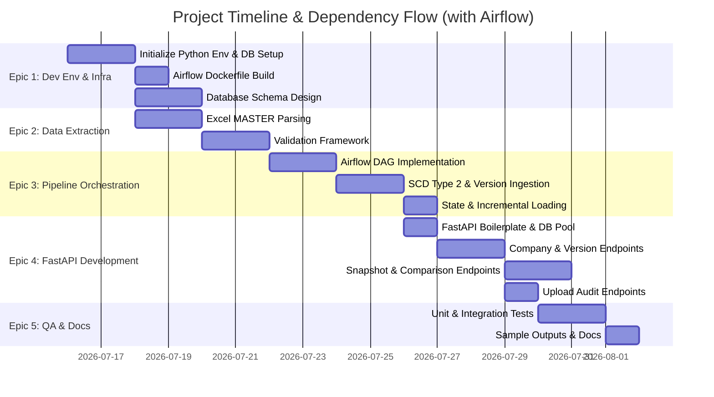

# Corporate Credit Rating Data Pipeline: Detailed Execution Plan (Airflow Orchestrated)

This document breaks down the implementation of the Corporate Credit Rating Data Pipeline project into **5 Epics** and **20 tickets**. Each ticket represents an actionable work unit.

---

## Epic 1: Development Environment & Infrastructure Setup

This epic focuses on setting up the containerized developer environment with multiple PostgreSQL databases (one for Airflow, one for the warehouse), building a custom Dockerfile for Airflow, and designing the database warehouse schema.

### Ticket 1.1: Initialize Python environment (`uv`, Python 3.13, `pyproject.toml`)
* **Description:** Install and configure the local Python environment using `uv` and Python 3.13. Confirm all dependencies defined in [pyproject.toml](file:///home/rd/repos/data_engineer_task/pyproject.toml) install correctly.
* **Tasks:**
  1. Initialize `uv` workspace locally in the task folder.
  2. Create a virtual environment using Python 3.13: `uv venv --python 3.13`.
  3. Install dependencies from `pyproject.toml` using `uv pip install -e .` or `uv sync`.
  4. Verify package installation (`fastapi`, `pandas`, `sqlalchemy`, `openpyxl`).
* **Verification:** Successful creation of `.venv` and execution of a dummy Python script importing these packages.

### Ticket 1.2: Set up Multi-Database Docker Compose Setup (Warehouse DB + Airflow DB)
* **Description:** Configure the containerized infrastructure using Docker Compose to spin up a PostgreSQL instance for the Data Warehouse and another isolated PostgreSQL instance for Airflow's metadata storage to prevent port/data conflicts.
* **Tasks:**
  1. Create a `docker-compose.yml` file in the root directory.
  2. Define a service `warehouse_db` (using `postgres:15-alpine` mapping internal port 5432 to external 5432).
  3. Define a service `airflow_db` (using `postgres:15-alpine` mapping internal port 5432 to external 5435 or using internal networking).
  4. Set up separate persistent Docker volumes: `warehouse_data` and `airflow_data`.
  5. Add health checks to ensure both databases are fully ready.
* **Verification:** Run `docker compose up -d warehouse_db airflow_db` and ensure both containers run and have separate persistent storage.

### Ticket 1.3: Build custom Apache Airflow Dockerfile
* **Description:** Build a custom Apache Airflow Dockerfile (extending standard Apache Airflow 2.x image) that installs custom packages like `pandas`, `openpyxl`, `sqlalchemy`, and `psycopg` to allow running Python rating parsers in DAG tasks.
* **Tasks:**
  1. Create a `docker/airflow.Dockerfile` in the repository.
  2. Inherit from a standard `apache/airflow:2.9.0-python3.11` (or Python 3.10) image.
  3. Install extra Python modules matching project needs (`openpyxl`, `pandas`, `sqlalchemy`, `psycopg-binary`).
  4. Configure user permissions so that Airflow can read the mounted `/data` directory.
  5. Add the `airflow-webserver` and `airflow-scheduler` services to `docker-compose.yml`.
* **Verification:** Run `docker compose build` and ensure the custom Airflow image builds successfully.

### Ticket 1.4: Define Warehouse Schema & Migrations
* **Description:** Design the star schema database model (dimensions, fact tables, SCD Type 2 tracking, and upload audits) and create Alembic/SQL scripts to deploy them to `warehouse_db`.
* **Tasks:**
  1. Design the star schema database model:
     - **`dim_company`**: SCD Type 2 table tracking entity metadata (`company_id`, `company_name`, `sector`, `country`, `currency`, `accounting_principles`, `business_year_end_month`, `valid_from`, `valid_to`, `is_current`).
     - **`dim_methodology`**: Methodology profiles / rating templates.
     - **`fact_rating_snapshot`**: Captures weights and scores for the industry risk factors, linking to the dimensions.
     - **`dim_upload_audit`**: Audit table to store upload details (timestamp, source filename, version, binary content of the file).
  2. Initialize Alembic migrations inside the repo.
  3. Set database connections to run migrations on container start of the application.
* **Verification:** Upgrade the schema on `warehouse_db` and confirm tables and indexes exist.

---

## Epic 2: Excel Extraction & Custom Parsing (Extract & Validate)

This epic covers building the custom parser to parse non-standard sheets inside the `.xlsm` files and validating the extracted data.

### Ticket 2.1: Custom Excel Parser for `MASTER` sheet
* **Description:** Write a module to open the `.xlsm` files, access only the `MASTER` sheet, and map the key-value layout to structured Python dictionaries.
* **Tasks:**
  1. Use `openpyxl` or `pandas` to read the `MASTER` sheet.
  2. Map the non-standard column structure (e.g., Unnamed columns) to locate fields.
  3. Safely parse key-value rows from the spreadsheet.
* **Verification:** Unit tests reading local `.xlsm` sample files and printing extracted raw key-value pairs.

### Ticket 2.2: Extract metadata, methodology, and risk scores/weights
* **Description:** Specifically parse metadata properties (company name, sector, country, currency, business year-end, methodology) and extract the industry risk factors (risk factors, their scores, and their weights).
* **Tasks:**
  1. Parse entity details (Entity Name, Sector, Country, Currency, Accounting Principles, Business Year-End).
  2. Identify the dynamic section containing industry risk weights and scores.
  3. Extract these tables/rows and associate them with the company version.
* **Verification:** Verify that the output structure contains a clean nested JSON object representing both company details and risk profiles.

### Ticket 2.3: Data Validation Framework
* **Description:** Implement validation rules to check completeness, data types, and logical rules (e.g. weights sum to 1.0, scores are between 1 and 10 or whatever valid range the model uses).
* **Tasks:**
  1. Build a validation runner that validates each extracted file's data.
  2. Check required fields: rated entity, currency, sector, country.
  3. Validate weight limits: sum of weights for industry risk categories equals exactly 1.0 (with floating-point tolerance).
  4. Validate scores are within valid ranges.
* **Verification:** Run the validator on intentionally malformed test inputs and verify that failures are correctly flagged.

### Ticket 2.4: Validation and Quality Reporting
* **Description:** Write a reporting helper to output a detailed data quality report (missing fields, validation errors, completeness metrics) for each processed file.
* **Tasks:**
  1. Define a Pydantic schema for the validation report.
  2. Save validation outputs as structured files (e.g., JSON logs) or inside a pipeline status table in PostgreSQL.
* **Verification:** Run a test pipeline run and inspect the generated validation report.

---

## Epic 3: Ingestion Logic & Airflow DAG Orchestration

This epic covers setting up the Airflow DAG structure and pipeline workflow logic (Extract, Validate, Transform, Load).

### Ticket 3.1: Implement SCD Type 2 dimension population
* **Description:** Write ingestion scripts that check if a rated company's metadata has changed. If so, end the current record (`valid_to = now`, `is_current = false`) and insert a new record (`valid_from = now`, `valid_to = null`, `is_current = true`).
* **Tasks:**
  1. When loading a company, query `dim_company` for the existing current record.
  2. Compare incoming metadata with database values.
  3. Implement transaction boundaries to safely expire the old record and insert the new record.
* **Verification:** Run pipeline on `corporates_A_1.xlsm`, then `corporates_A_2.xlsm`, and check that two rows exist in `dim_company` for Company A (one active, one expired).

### Ticket 3.2: Implement Snapshot Facts and File Auditing Ingestion
* **Description:** Insert files into the `dim_upload_audit` table (including file binary contents to support downloading original files later) and insert the risk scores/weights into the `fact_rating_snapshot` table.
* **Tasks:**
  1. Record file upload metadata in `dim_upload_audit` (and store file contents as a BLOB/BYTEA).
  2. Connect fact records to the correct version (SCD surrogate key) of `dim_company` and `dim_upload_audit`.
* **Verification:** Inspect the Postgres database and verify both tables are populated correctly.

### Ticket 3.3: Implement Pipeline State Management (Incremental Loading)
* **Description:** Track which files have been successfully processed (using file path and SHA-256 hash checksums) to implement incremental loading and guarantee idempotency.
* **Tasks:**
  1. Create a `pipeline_state` table to track processed file metadata.
  2. Before parsing a file, compute its hash and compare it against the `pipeline_state` table.
  3. If unchanged and already processed, skip the file.
* **Verification:** Run the pipeline twice on the same files; verify the second run skips all files and logs 0 changes.

### Ticket 3.4: Write the Airflow DAG Orchestrator
* **Description:** Define the Airflow DAG (`dags/corporate_rating_etl.py`) specifying the execution flow: scan directory, extract/validate, write to DB.
* **Tasks:**
  1. Create the DAG file with a set schedule (e.g. `@daily` or manually triggered).
  2. Define tasks:
     - `scan_files`: Find `.xlsm` files in `/data` that haven't been processed or whose hash changed.
     - `process_file`: Parse, validate, and write file data to the database using pipeline sub-modules.
  3. Configure transactional integrity across tasks. If one file fails, notify/log but allow other valid files to proceed (or fail gracefully).
* **Verification:** Trigger the DAG via the Airflow UI, monitor task execution status, and verify output database state.

---

## Epic 4: FastAPI REST API Development

This epic covers building the RESTful API endpoints for analytics, historical version lookup, comparisons, and file downloads.

### Ticket 4.1: Setup FastAPI structure, Dockerfile, and DB Connection Pooling
* **Description:** Create the FastAPI project structure, write a `fastapi.Dockerfile`, and configure connection pooling to `warehouse_db`. Add the FastAPI service to `docker-compose.yml`.
* **Tasks:**
  1. Create the project structure: `app/main.py`, `app/models/`, `app/routers/`, `app/schemas/`.
  2. Write a `docker/api.Dockerfile` mapping container port 8000.
  3. Configure DB connection pool targeting `warehouse_db:5432`.
  4. Link the api service to depend on `warehouse_db` health check in `docker-compose.yml`.
* **Verification:** Access Swagger UI at `http://localhost:8000/docs` while the compose cluster is running.

### Ticket 4.2: Develop Company endpoints
* **Description:** Implement CRUD-read endpoints for company metadata and history.
* **Endpoints to implement:**
  - `GET /companies`: List all companies with current metadata.
  - `GET /companies/{company_id}`: Get latest company metadata and current ratings.
  - `GET /companies/{company_id}/versions`: Get all upload versions and historical metadata changes for a specific company (version navigation).
  - `GET /companies/{company_id}/history`: Get time-series rating data (scores and weights) for the company.
* **Verification:** Perform requests to these endpoints and verify returned JSON.

### Ticket 4.3: Develop Snapshot and Comparison endpoints
* **Description:** Implement points-in-time comparisons and filtered snapshots.
* **Endpoints to implement:**
  - `GET /snapshots`: List company snapshots filtered by `from_date`, `to_date`, `sector`, `country`, `currency`.
  - `GET /snapshots/latest`: Get the latest snapshot for every company.
  - `GET /companies/compare`: Compare multiple companies at a specific point in time (as of date). Resolves which SCD Type 2 record was active at `as_of_date`.
* **Verification:** Test query params like `?company_ids=1&company_ids=2&as_of_date=2026-07-15` and check the correct metadata/scores are selected.

### Ticket 4.4: Develop Upload Audit endpoints
* **Description:** Implement endpoints to track, audit, and retrieve the original uploaded Excel files.
* **Endpoints to implement:**
  - `GET /uploads`: List all file uploads with metadata.
  - `GET /uploads/{upload_id}/details`: Detailed summary of a specific file upload.
  - `GET /uploads/{upload_id}/file`: Download the original `.xlsm` binary file.
  - `GET /uploads/stats`: Return upload statistics (e.g., total files processed, total failures, success rate).
* **Verification:** Request `/uploads/{upload_id}/file` and verify the download is an identical, valid Excel file.

---

## Epic 5: Testing, Quality Assurance, and Documentation

This epic ensures the code is reliable, validated, fully documented, and ready for handoff.

### Ticket 5.1: Write unit tests for Excel parsing and validation
* **Description:** Implement unit tests using `pytest` for parsing raw spreadsheets and testing validation logic.
* **Tasks:**
  1. Write tests with mocked inputs.
  2. Check parser against correct files.
  3. Validate rules: weight sum fails, invalid scores.
* **Verification:** Running `pytest tests/unit` passes with 100% success.

### Ticket 5.2: Write integration tests for API endpoints and pipeline
* **Description:** Write integration tests that load test Excel files, trigger the pipeline, and query the FastAPI application.
* **Tasks:**
  1. Set up an isolated test database container or clean schema.
  2. Execute the ETL pipeline with the sample files in `data/`.
  3. Query the FastAPI endpoints using `TestClient` or `httpx` to verify return schemas.
* **Verification:** Running `pytest tests/integration` passes.

### Ticket 5.3: Generate Sample Outputs & Complete API Documentation
* **Description:** Generate at least 10 sample API requests/responses, export the OpenAPI spec, and document pipeline logs.
* **Tasks:**
  1. Use curl or httpx to capture sample outputs from the API endpoints.
  2. Create sample execution logs and data quality reports.
  3. Save these in a dedicated `/docs` or `/artifacts` directory.
* **Verification:** Verify that all required deliverables are present in the final package.

### Ticket 5.4: Fill out the `AI_USAGE.md` form
* **Description:** Complete the required self-assessment, list AI tools, detail components assisted, and link logs.
* **Tasks:**
  1. Complete sections 1 to 6 in `AI_USAGE.md`.
  2. Attach or link chat logs.
* **Verification:** File is fully populated and saved in the workspace root.
